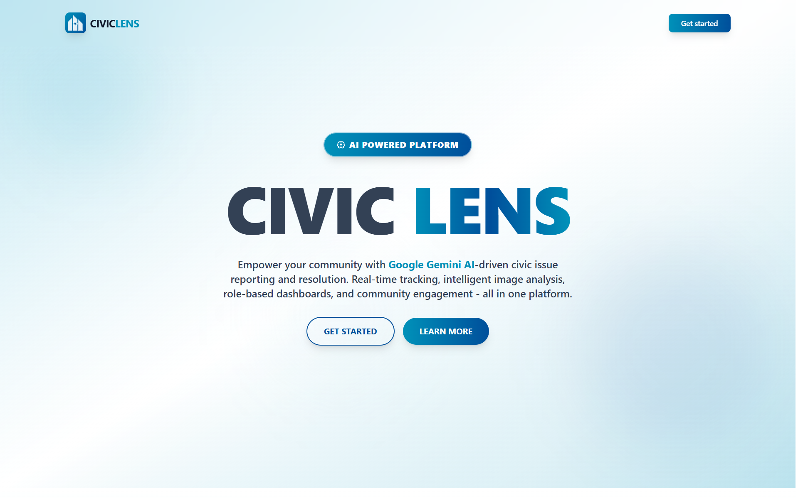
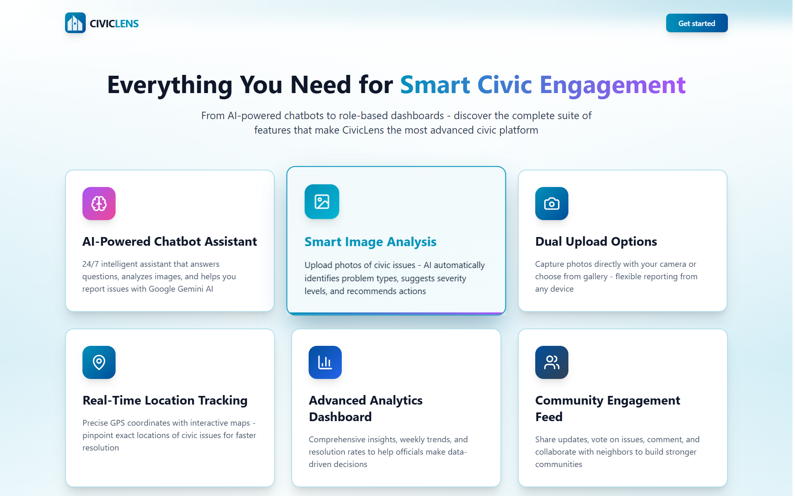
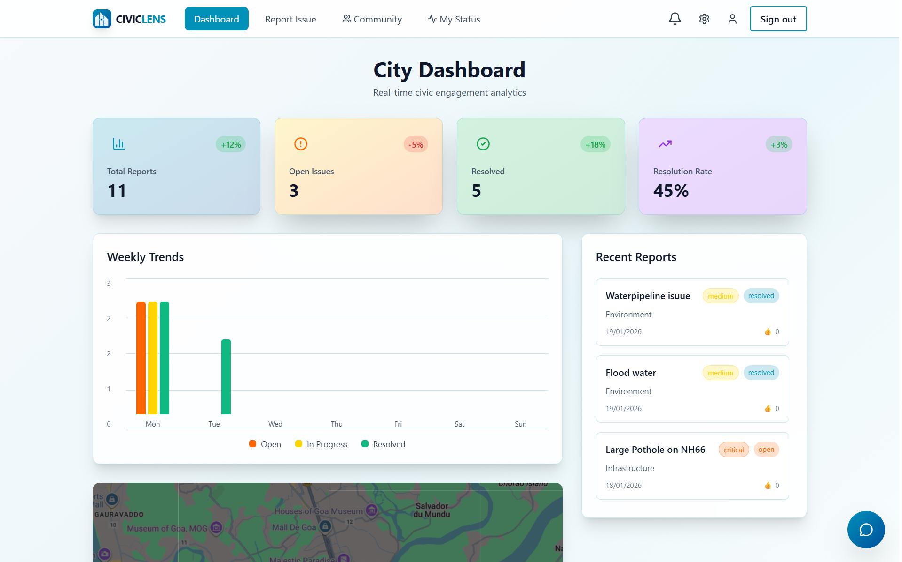
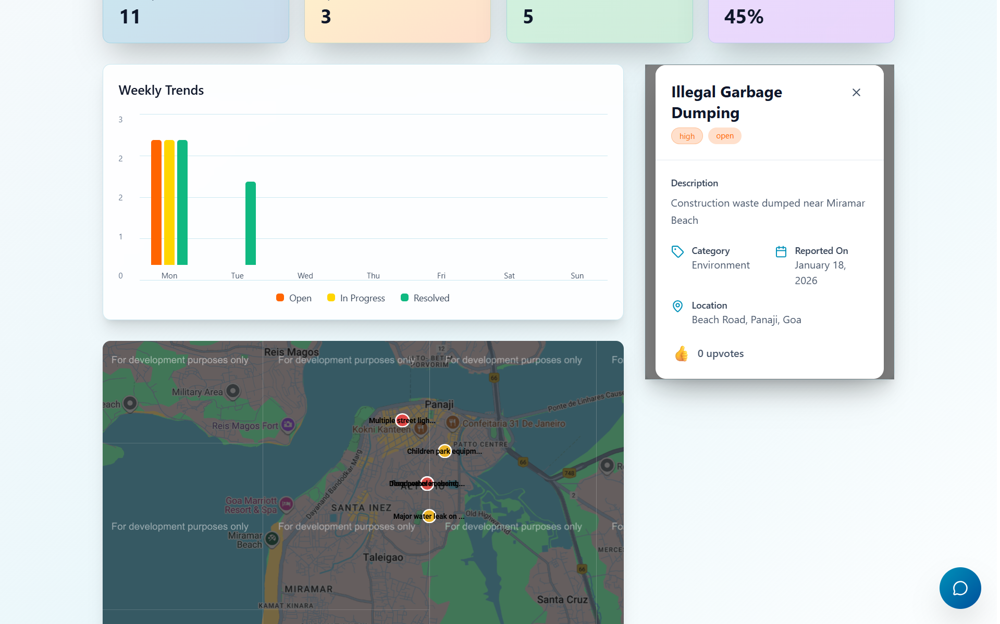
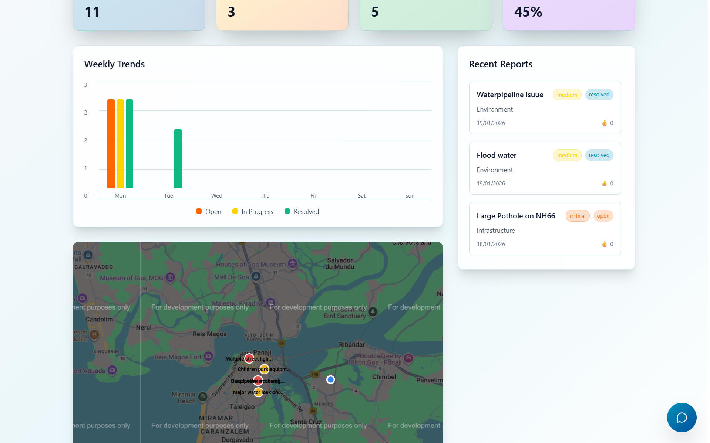
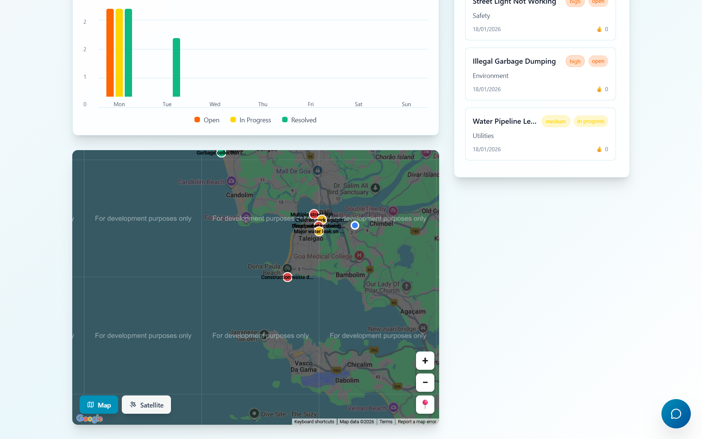

# 🏙️ CivicLens — AI-Powered Civic Engagement Platform

> **Transform how communities report, analyze, and resolve civic issues using real-time maps, AI assistance, and interactive dashboards.**

[](https://reactjs.org/)
[](https://www.typescriptlang.org/)
[](https://vitejs.dev/)
[](https://tailwindcss.com/)
[](LICENSE)

---

## 📸 Screenshots & Demo

### 🏠 Landing Page & Hero
<table>
  <tr>
    <td width="50%">
      
      <p><em>Modern landing page with video background</em></p>
    </td>
    <td width="50%">
      
      <p><em>Clear call-to-action and feature highlights</em></p>
    </td>
  </tr>
</table>

### 📊 Dashboard & Analytics
<table>
  <tr>
    <td width="50%">
      
      <p><em>Real-time analytics at a glance</em></p>
    </td>
    <td width="50%">
      
      <p><em>Key metrics and statistics</em></p>
    </td>
  </tr>
  <tr>
    <td width="50%">
      
      <p><em>Visual trends and patterns</em></p>
    </td>
    <td width="50%">
      
      <p><em>Geographic issue distribution</em></p>
    </td>
  </tr>
</table>


try out the rest of the features  by signing up for the website!! 

## ✨ Overview

**CivicLens** is a next-generation civic engagement platform that empowers citizens to report civic issues efficiently while providing administrators with AI-powered insights and real-time analytics. The app combines interactive mapping, AI chatbot assistance, and intuitive mobile-first design to bridge the gap between communities and city services.

### 🚀 Key Tech Stack
- **Frontend**: React 18 + TypeScript + Vite
- **Styling**: Tailwind CSS with custom design system
- **Maps**: React Leaflet + OpenStreetMap (no API key required)
- **Backend**: Supabase (PostgreSQL with real-time subscriptions)
- **AI**: Google Gemini AI for intelligent assistance
- **UI Components**: Lucide React icons, Framer Motion animations, Sonner toasts
- **Auth**: Clerk Authentication (secure, scalable auth solution)

---

## 🎯 Core Features

### 🗣️ Smart Issue Reporting
- **Interactive Map Picker**: Click to select exact location of civic issues
- **Photo Upload**: Visual documentation with image support
- **Smart Categorization**: Organize reports by type (Roads, Lighting, Sanitation, etc.)
- **Tag System**: Searchable and filterable issue tags
- **Real-time Submission**: Instant report processing with live feedback

### 🤖 AI-Powered Assistant
- **Google Gemini Integration**: Intelligent chatbot for civic queries
- **Image Analysis**: AI can analyze uploaded photos to categorize issues
- **Natural Language Processing**: Ask questions in plain English
- **Context-Aware Responses**: Personalized help based on your reports
- **24/7 Availability**: Get assistance anytime, anywhere

### 📊 Advanced Analytics Dashboard
- **Real-time Metrics**: Live statistics on reported issues
- **Trend Analysis**: Visualize issue patterns over time
- **Category Breakdown**: See which civic problems need most attention
- **Geographic Heatmaps**: Identify problem hotspots in your area
- **Status Tracking**: Monitor resolution progress

### 🗺️ Interactive Mapping
- **OpenStreetMap Integration**: Free, open-source mapping
- **Marker Clustering**: Clean visualization of dense issue areas
- **Filter by Category**: Show only specific types of issues
- **Mobile-Optimized**: Touch-friendly map controls
- **Geolocation Support**: Auto-detect your current location

### 👥 Community Engagement
- **Community Feed**: Share and discuss civic issues
- **Upvote System**: Prioritize important issues democratically
- **Comments & Discussions**: Collaborate on solutions
- **User Profiles**: Track your civic contributions
- **Social Sharing**: Spread awareness of local issues

### 🔒 Security & Privacy
- **Secure Authentication**: Powered by Clerk Auth
- **Anonymous Reporting**: Report issues without creating an account
- **Data Encryption**: All sensitive data encrypted in transit and at rest
- **Row-Level Security**: Supabase RLS policies protect user data
- **No API Key Exposure**: Environment variables kept secure

---

## 🚀 Getting Started

### Prerequisites
```bash
Node.js >= 16.0.0
npm >= 8.0.0 or yarn >= 1.22.0
```

### Installation

1. **Clone the repository**:
   ```bash
   git clone https://github.com/yourusername/civiclens_-_ai-powered_civic_platform.git
   cd civiclens_-_ai-powered_civic_platform
   ```

2. **Install dependencies**:
   ```bash
   npm install
   ```

3. **Set up environment variables**:
   Create a `.env.local` file in the root directory:
   ```env
   # Google Maps API Key (optional for geocoding)
   VITE_GOOGLE_MAPS_API_KEY=your_maps_api_key

   # Supabase Configuration
   VITE_SUPABASE_URL=your_supabase_url
   VITE_SUPABASE_ANON_KEY=your_supabase_anon_key

   # Google Gemini AI API Key
   VITE_GEMINI_API_KEY=your_gemini_api_key
   ```

   > **Important**: Never commit `.env.local` to version control!

4. **Run the development server**:
   ```bash
   npm run dev
   ```

5. **Open in browser**:
   Navigate to `http://localhost:5173`

---

## 🏗️ Project Structure

```
civiclens_-_ai-powered_civic_platform/
├── src/
│   ├── components/          # React components
│   │   ├── LandingPage.tsx     # Hero page with animations
│   │   ├── Dashboard.tsx       # Analytics dashboard
│   │   ├── ReportForm.tsx      # Issue reporting form
│   │   ├── ReportsMap.tsx      # Interactive map view
│   │   ├── AIChatbot.tsx       # AI assistant interface
│   │   ├── CommunityFeed.tsx   # Social features
│   │   ├── IoTSensors.tsx      # IoT integration
│   │   ├── StatsCard.tsx       # Dashboard widgets
│   │   ├── TrendsChart.tsx     # Analytics charts
│   │   └── RecentReports.tsx   # Activity feed
│   ├── lib/
│   │   ├── gemini.ts           # AI integration logic
│   │   └── utils.ts            # Utility functions
│   ├── App.tsx                 # Main app component
│   ├── main.tsx                # Entry point
│   └── index.css               # Global styles
├── convex/                   # Backend (if using Convex)
├── assets/                   # Static assets & screenshots
├── public/                   # Public assets
├── .env.local               # Environment variables (gitignored)
├── .gitignore               # Git ignore rules
├── package.json             # Dependencies
├── tailwind.config.js       # Tailwind CSS configuration
├── tsconfig.json            # TypeScript configuration
├── vite.config.ts           # Vite configuration
└── README.md                # This file
```

---

## 🎨 Tech Stack Deep Dive

### Frontend
- **React 18**: Latest features including concurrent rendering
- **TypeScript**: Type-safe development experience
- **Vite**: Lightning-fast HMR and optimized builds
- **Tailwind CSS**: Utility-first CSS framework for rapid UI development

### Backend & Database
- **Supabase**: PostgreSQL database with real-time subscriptions
- **Row Level Security (RLS)**: Secure data access patterns
- **Realtime**: Live updates for collaborative features
- **Storage**: Secure image uploads with signed URLs

### Maps & Geolocation
- **React Leaflet**: Declarative React wrapper for Leaflet
- **OpenStreetMap**: Free, open-source map tiles
- **Geolocation API**: Browser-native location detection

### AI & Machine Learning
- **Google Gemini AI**: State-of-the-art language model
- **Vision API**: Image recognition for civic issue categorization
- **Natural Language Processing**: Understand user queries

### UI/UX Libraries
- **Framer Motion**: Smooth, physics-based animations
- **Lucide React**: Beautiful, consistent icon set
- **Sonner**: Elegant toast notifications
- **Radix UI**: Accessible, unstyled component primitives

---

## 📱 Usage Guide

### For Citizens

1. **📍 Report an Issue**
   - Click the floating action button or "Report Issue" in navigation
   - Fill in the report details (title, description, category)
   - Click on the map to set the exact location
   - Optionally upload a photo for visual evidence
   - Add relevant tags for better categorization
   - Submit and track your report's progress

2. **💬 Get AI Assistance**
   - Open the AI chatbot from the dashboard
   - Ask questions about civic processes
   - Get help categorizing issues
   - Receive suggestions for effective reporting
   - Upload images for AI-powered analysis

3. **📊 View Analytics**
   - Check the dashboard for community-wide statistics
   - See trending issues in your area
   - Monitor resolution rates
   - Explore heatmaps of issue concentrations

4. **👥 Engage with Community**
   - Browse the community feed
   - Upvote important issues
   - Comment and discuss solutions
   - Follow updates on issues you care about

### For Administrators

- **Monitor real-time metrics** and identify emerging problems
- **Use interactive maps** to plan resource allocation
- **Analyze trends** to make data-driven decisions
- **Track resolution rates** and team performance
- **Export reports** for city council presentations

---

## 🔧 Development

### Available Scripts

```bash
npm run dev          # Start development server
npm run build        # Build for production
npm run preview      # Preview production build
npm run lint         # Run ESLint
```

### Building for Production

```bash
npm run build
```

The optimized production build will be in the `dist/` folder.

### Environment Setup

**Required Environment Variables:**
- `VITE_SUPABASE_URL`: Your Supabase project URL
- `VITE_SUPABASE_ANON_KEY`: Supabase anonymous key
- `VITE_GEMINI_API_KEY`: Google Gemini AI API key

**Optional:**
- `VITE_GOOGLE_MAPS_API_KEY`: For enhanced geocoding features

---

## 🤝 Contributing

We welcome contributions! Here's how you can help:

1. **Fork the repository**
2. **Create a feature branch**: `git checkout -b feature/amazing-feature`
3. **Commit your changes**: `git commit -m 'Add amazing feature'`
4. **Push to the branch**: `git push origin feature/amazing-feature`
5. **Open a Pull Request**

### Areas We'd Love Help With
- 🎨 UI/UX improvements and accessibility
- 📱 Mobile responsiveness enhancements
- 🌍 Internationalization (i18n) support
- 🧪 Unit and integration tests
- 📚 Documentation improvements
- ♿ Accessibility (WCAG compliance)

---

## 🛣️ Roadmap

### Phase 1: Foundation ✅
- [x] Core issue reporting functionality
- [x] Interactive map integration
- [x] Basic analytics dashboard
- [x] AI chatbot integration
- [x] Community feed features

### Phase 2: Enhancement 🚧
- [ ] Advanced AI image recognition
- [ ] Multi-language support
- [ ] Email notifications
- [ ] Admin dashboard improvements
- [ ] Data export capabilities

### Phase 3: Scale 📈
- [ ] Mobile apps (iOS/Android)
- [ ] API for third-party integrations
- [ ] Advanced machine learning models
- [ ] Predictive analytics
- [ ] Government integration tools

---

## 📄 License

This project is licensed under the MIT License - see the [LICENSE](LICENSE) file for details.

---

## 👨‍💻 Created By

**Naman Gaonkar**

Passionate about civic tech, community engagement, and building solutions that create real-world impact.

- 🌐 GitHub: [@NamanGaonkar](https://github.com/NamanGaonkar)
- 💼 LinkedIn: [Naman Gaonkar](https://linkedin.com/in/naman-gaonkar)
- 📧 Email: your.email@example.com

---

## 🙏 Acknowledgments

- Built with ❤️ using **React**, **TypeScript**, and **Tailwind CSS**
- Maps powered by **OpenStreetMap** and **Leaflet**
- Database and real-time features by **Supabase**
- AI capabilities by **Google Gemini**
- Icons from **Lucide React**
- Animations by **Framer Motion**
- UI components from **Radix UI**

---

## 📞 Support & Feedback

Have questions, feedback, or found a bug?

- 🐛 [Open an Issue](https://github.com/yourusername/civiclens/issues)
- 💬 [Start a Discussion](https://github.com/yourusername/civiclens/discussions)
- 📧 Email: support@civiclens.com

---

<div align="center">

**⭐ Star this repo if you find it useful!**

**Let's build better communities together! 🌍🏙️**

Made with 💙 for civic engagement

</div>

### Prerequisites
- Node.js (v16+)
- npm or yarn
- A modern web browser

### Installation & Running

1. **Clone the repository** (once pushed to GitHub):
```bash
git clone https://github.com/NamanGaonkar/civiclens_-_ai-powered_civic_platform.git
cd civiclens_-_ai-powered_civic_platform
```

2. **Install dependencies**:
```powershell
npm install
```

3. **Start the dev server**:
```powershell
npm run dev
```

4. **Open in browser**:
   Navigate to `http://localhost:5173` (or the URL shown in terminal)

### Notes
- Tailwind CSS directives (`@tailwind`, `@apply`) are build-time processed — static analyzers may flag them as warnings, but the dev server handles them correctly.
- Leaflet maps require the CSS import in `main.tsx` — this is already configured.
- Auth uses Convex Auth with anonymous sign-in support.

---

##  Project Structure

```
src/
├── components/
│   ├── LandingPage.tsx          # Hero page with video & CTAs
│   ├── Dashboard.tsx            # Analytics & stats dashboard
│   ├── ReportForm.tsx           # Report submission with map picker
│   ├── ReportsMap.tsx           # Interactive map of all reports
│   ├── AIChatbot.tsx            # AI assistant UI (responsive)
│   ├── StatsCard.tsx            # Dashboard stat cards
│   ├── TrendsChart.tsx          # Analytics trends
│   └── RecentReports.tsx        # Activity feed
├── App.tsx                       # Main routing & layout
├── main.tsx                      # Entry point (Leaflet CSS imported here)
├── index.css                     # Tailwind directives & custom classes
└── vite-env.d.ts

convex/
├── schema.ts                     # Database schema
├── reports.ts                    # Report mutations/queries
├── analytics.ts                  # Analytics queries
├── auth.ts                       # Auth configuration
└── _generated/                   # Auto-generated Convex API

assets/
├── a.png - g.png               # Screenshots & UI images
```

---

##  How to Use

### For Citizens
1. **Sign Up/Sign In**: Use the authentication form (anonymous or email/password)
2. **Report an Issue**: 
   - Click the floating report button (mobile) or "Report Issue" nav link (desktop)
   - Fill in title, description, and category
   - Click on the map to pinpoint the exact location
   - Optionally upload a photo
   - Add relevant tags
   - Submit the report
3. **Chat with AI**: Open the chatbot on the dashboard for assistance
4. **View Analytics**: Check the dashboard to see community-wide issue trends

### For Administrators
- Monitor real-time report metrics and trends
- Use the interactive map to identify issue hotspots
- Review AI-powered analysis of submitted reports (coming soon)
- Track resolution rates and community engagement

---

##  Security & Privacy

- Authentication powered by Convex Auth
- Anonymous posting supported for civic participation
- User sessions managed securely
- Image uploads handled via secure Convex storage with signed URLs
- No API keys exposed in client code

---

##  Upcoming Features

- **Real AI Integration**: Google Gemini for intelligent report classification and analysis
- **Image Recognition**: Automatic categorization of civic issues from photos
- **Advanced Analytics**: Machine learning insights for city planners
- **Community Voting**: Upvote/downvote reports to prioritize action
- **Notification System**: Real-time alerts for report updates
- **Export & Reporting**: City admin dashboards with data export capabilities

---

##  Development

### Tech Details
- **State Management**: React hooks + Convex queries/mutations
- **Styling**: Tailwind CSS utility classes
- **Animations**: Framer Motion
- **Maps**: react-leaflet with OpenStreetMap (free, no API key required)
- **Build Tool**: Vite (fast HMR and optimized builds)
- **Icons**: lucide-react (beautiful SVG icons)

### Build for Production
```powershell
npm run build
npm run preview
```

### Environment Variables
Create a `.env.local` file if needed (Convex handles most config):
```
VITE_CONVEX_URL=your_convex_deployment_url
```

---

## Performance & Scalability

- Convex handles real-time queries and automatic caching
- React's virtual DOM ensures smooth UI even with large datasets
- Leaflet provides optimized map rendering
- Mobile-first design minimizes data transfer
- Lazy loading for images and heavy components

---

##  Contributing

We welcome contributions! Areas where we'd love help:
- UI/UX improvements
- Mobile responsiveness enhancements
- Additional map features
- Translation support (i18n)
- Documentation

---

##  License

This project is open-source and available for educational and community use.

---

##  Created By

**Naman Gaonkar**

Passionate about civic tech, community engagement, and building solutions that create real-world impact.

- GitHub: [NamanGaonkar](https://github.com/NamanGaonkar)
- LinkedIn: [Naman Gaonkar](https://linkedin.com/in/naman-gaonkar)

---

##  Acknowledgments

- Built with **React**, **TypeScript**, and **Tailwind CSS**
- Maps powered by **OpenStreetMap** and **Leaflet**
- Backend infrastructure by **Convex**
- Icons from **lucide-react**
- Animations by **Framer Motion**

---

##  Support & Feedback

Have questions or feedback? Feel free to open an issue on GitHub or reach out directly.

**Let's build better communities together! 🌍**
  
